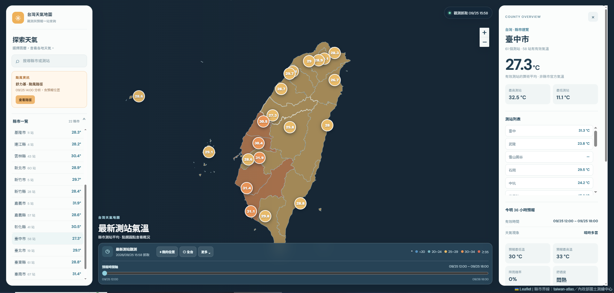
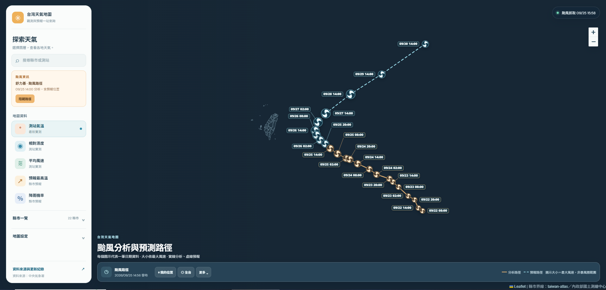

# AIoT-DA 課程作業｜AI Vibe Coding 天氣預報 HW1

## 我的專案連結

- **網站網址**：[https://l3-cwa-hw-1.vercel.app/](https://l3-cwa-hw-1.vercel.app/)
- **GitHub 儲存庫網址**：[https://github.com/HitomiHuang/L3_CWA_HW1](https://github.com/HitomiHuang/L3_CWA_HW1)

> **作業主題**：運用 AI 輔助開發台灣天氣預報與觀測地圖<br>
> **專案名稱**：台灣天氣觀測地圖<br>
> **資料來源**：中央氣象署（Central Weather Administration, CWA）開放資料

## 網站畫面

### 1. 全台測站氣溫與縣市概況



左側可搜尋地點、選擇地圖圖層及查看縣市清單；地圖上的數值呈現各縣市有效測站的平均氣溫。點選縣市後，右側顯示測站摘要、站點清單和今明 36 小時預報。放大地圖後可以看到測站位置與個別讀值。

### 2. 颱風分析與預測路徑



有近期熱帶氣旋資料時，左側會出現「颱風資訊」卡片。點選「查看路徑」可檢視分析位置與預報位置；實線表示分析路徑，虛線表示預報路徑。節點標示日期與時間，圖示大小依最大風速調整，**不表示暴風圈範圍**。路徑資訊不等於台灣已有颱風警報，仍應以中央氣象署正式發布資訊為準。

## 專案介紹

這份 HW1 以「AI Vibe Coding 天氣預報」為主題，將中央氣象署的測站觀測、今明 36 小時預報、一週預報與熱帶氣旋資料整理成可互動的台灣地圖。使用者可以從全台概況開始，切換氣溫、濕度、風速、預報最高溫與降雨機率，再深入查看縣市、測站和預報時段。

專案包含兩個展示入口：

| 入口 | 用途 | 使用資料 |
| --- | --- | --- |
| [Vercel 線上網站](https://l3-cwa-hw-1.vercel.app/) | 全版面互動地圖，適合直接瀏覽與分享 | 已公開的 `public/data/snapshot.json` |
| `app.py` Streamlit 介面 | 課程資料分析展示，包含表格、圖表與歷次預報比較 | 本機 SQLite 資料庫 |

網站是靜態前端。API 授權碼只供 Python 抓取資料使用，不會放進瀏覽器或公開 JSON。網站畫面會隨已發布的資料快照更新；截圖中的溫度、時間與颱風路徑只是拍攝當下的示例。

## 功能說明

| 功能 | 操作與呈現內容 |
| --- | --- |
| 五種天氣圖層 | 切換測站氣溫、相對濕度、平均風速、縣市預報最高溫、縣市降雨機率。觀測與預報使用不同資料來源，畫面會標示資料時間。 |
| 地圖與地點搜尋 | 搜尋縣市或測站；點選地圖標記、縣市清單或測站清單檢視資料。可縮放地圖、切換縣市氣象圖與 OpenStreetMap 街道圖，並使用「全台」回到全台視角。 |
| 縣市概況與詳細資料 | 縣市總覽顯示有效測站平均氣溫、最高與最低測站及目前選取時段的預報。展開後可看測站觀測、今明 36 小時預報、前四個一週預報時段與趨勢圖。 |
| 預報時間軸 | 在一般天氣畫面切換預報有效時段；預報圖層的下拉選單與時間軸、地圖及縣市摘要同步。 |
| 颱風路徑 | 有近期資料時顯示熱帶氣旋卡片，可切換分析與預測路徑，點選節點查看時間與資訊。颱風模式不提供預報時間軸或自動播放。 |
| 個人化與分享 | 收藏常看的縣市；使用「分享」複製包含縣市、圖層及預報時段的網址。「我的位置」在取得瀏覽器定位權限後選取附近的有效測站。 |
| 資料匯出與查核 | 「更多」可下載目前圖層 CSV、重新讀取已發布的 JSON；「資料來源與更新紀錄」可查看抓取與發布時間、最近的爬蟲結果。 |
| 行動裝置 | 手機版使用可開合的側邊選單。 |

> **資料解讀**：測站氣溫、濕度、風速是實際觀測；預報最高溫與降雨機率是縣市預報。全台視角顯示的「縣市測站平均」是本專案對有效測站做算術平均，**不是中央氣象署發布的縣市官方氣溫**。預報圖層標記使用縣市代表座標，並非測站實際位置。資料更新可能延遲，請留意畫面的觀測、預報與抓取時間。

## 資料處理流程

```text
中央氣象署開放資料 API
        ↓ Python 抓取與解析
SQLite（資料批次、測站資料、爬蟲執行紀錄）
        ↓ 匯出不含授權碼的 JSON
public/data/snapshot.json
        ↓ GitHub Actions 提交、Vercel 重新部署
瀏覽器中的互動式天氣地圖
```

Python 會抓取四類資料：

| 資料集 | 編號 | 網站用途 |
| --- | --- | --- |
| 今明 36 小時天氣預報 | `F-C0032-001` | 各縣市天氣現象、溫度、降雨機率與時段趨勢 |
| 一週預報 | `F-D0047-091` | 每 12 小時預報與未來一週摘要 |
| 全測站逐時氣象資料 | `O-A0001-001` | 測站位置、觀測時間、氣溫、濕度及風速 |
| 熱帶氣旋分析與預報 | `W-C0034-005` | 近期熱帶氣旋的分析及預報位置 |

每次抓取都記錄於 SQLite 的 `crawl_runs`。成功的資料批次才更新對應資料；失敗不會覆蓋上一筆成功資料。匯出的快照包含最新可用資料與最近的執行紀錄，前端可顯示資料時間。過期的颱風路徑不會在網站上顯示。

## 技術與專案結構

- **前端**：HTML、CSS、JavaScript、Leaflet 地圖與 TopoJSON 縣市界線。
- **資料處理**：Python 標準函式庫抓取與解析 CWA 資料，SQLite 儲存批次，再匯出 JSON。
- **分析介面**：Streamlit、Pandas、Folium 與 Plotly。
- **更新與部署**：GitHub Actions 每 6 小時嘗試更新資料；Vercel 發布 `public/` 靜態網站。

| 路徑 | 說明 |
| --- | --- |
| `public/index.html`、`public/site.css`、`public/app.js` | 網站介面、地圖與互動功能 |
| `public/data/snapshot.json` | 前端讀取的公開資料快照 |
| `public/data/counties-10t.json` | 台灣縣市界線資料 |
| `services/` | CWA API、各資料集解析與 JSON 匯出 |
| `database/` | SQLite schema 與資料存取 |
| `scripts/fetch_once.py` | 執行一次抓取或只匯出快照 |
| `scripts/dev_server.py` | 預覽與 Vercel 相同的靜態檔案 |
| `app.py`、`components/` | Streamlit 課程展示與圖表元件 |
| `.github/workflows/refresh-weather.yml` | 排程抓取與提交資料快照 |
| `docs/images/` | 本 README 使用的網站截圖 |

## 本機執行

### 1. 準備環境與授權碼

需要 **Python 3.11 以上**。到[中央氣象署開放資料平台](https://opendata.cwa.gov.tw/)申請授權碼後，將專案根目錄的 `.env.example` 複製為 `.env`，填入：

```dotenv
CWA_API_KEY=你的中央氣象署授權碼
```

`.env` 已列入 `.gitignore`，請勿把授權碼放入 README、前端程式或提交紀錄。

### 2. 抓取資料並預覽網站

從專案根目錄執行：

```powershell
python scripts/fetch_once.py --all
python scripts/dev_server.py
```

瀏覽器開啟 [http://127.0.0.1:8765/](http://127.0.0.1:8765/)。第一次抓取會建立 `database/weather.db`，並更新 `public/data/snapshot.json`。只想查看儲存庫內現有快照時，直接啟動 `dev_server.py` 即可；若要從已有的 SQLite 資料庫重新匯出網站快照，可執行：

```powershell
python scripts/fetch_once.py --export-only
```

### 3. 啟動 Streamlit 課程展示

```powershell
python -m pip install -r requirements.txt
python -m streamlit run app.py
```

Streamlit 介面可查看測站觀測、各縣市預報、溫度與降雨趨勢、全台同時段排行，以及同一有效時段的歷次預報版本。也能手動更新 36 小時預報、一週預報和測站觀測；畫面中的「爬蟲執行紀錄（SQLite）」可協助確認抓取結果。

## 線上更新與部署

1. 在 GitHub 儲存庫的 **Settings → Secrets and variables → Actions** 新增 Repository secret：`CWA_API_KEY`。
2. 將儲存庫匯入 Vercel，Framework Preset 選 **Other**，Root Directory 設為專案根目錄。`vercel.json` 已將輸出目錄指定為 `public`；Vercel 不需要設定 API 授權碼。
3. `.github/workflows/refresh-weather.yml` 每 6 小時執行一次，也可從 GitHub Actions 手動執行。流程將最新 SQLite 資料庫和 JSON 快照提交回儲存庫，Vercel 再依 Git 提交重新部署。

排程可能因 GitHub Actions 延遲、缺少 secret 或儲存庫權限設定而未完成。網站「重新讀取」只會再次讀取**已發布**的 JSON，不會直接呼叫 CWA API 或啟動爬蟲；請以畫面標示的時間判斷資料新舊。`database/weather.db` 平常受 `.gitignore` 保護，排程才明確將它加入資料更新提交。

## 驗證方式

```powershell
python -m unittest discover -s tests -v
node --check public/app.js
```

測試使用離線範例資料，檢查成功與失敗抓取紀錄，以及匯出的 JSON 是否包含最新資料且不含 API 授權碼。前端可透過本機預覽檢查圖層切換、縣市詳情與不同螢幕寬度下的版面。

## 資料來源與地圖授權

- [中央氣象署開放資料平台](https://opendata.cwa.gov.tw/)
- [今明 36 小時天氣預報 `F-C0032-001`](https://opendata.cwa.gov.tw/dataset/forecast/F-C0032-001)
- [一週預報 `F-D0047-091`](https://opendata.cwa.gov.tw/dataset/forecast/F-D0047-091)
- [全測站逐時氣象資料 `O-A0001-001`](https://opendata.cwa.gov.tw/dataset/statisticDays/O-A0001-001)
- [熱帶氣旋分析與預報 `W-C0034-005` 格式文件](https://opendata.cwa.gov.tw/opendatadoc/Warning/W-C0034-005.pdf)
- 街道底圖：[OpenStreetMap](https://www.openstreetmap.org/copyright)；縣市界線：[taiwan-atlas](https://github.com/dkaoster/taiwan-atlas)／內政部國土測繪中心，授權文字見 `public/data/counties-10t.LICENSE.txt`。

---

**線上體驗**：[台灣天氣觀測地圖](https://l3-cwa-hw-1.vercel.app/) · **原始碼**：[GitHub 儲存庫](https://github.com/HitomiHuang/L3_CWA_HW1)
